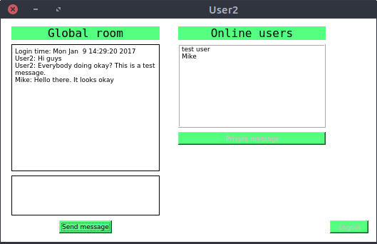
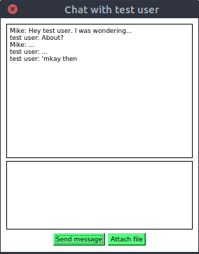

# linux-chat-application

## Overview
A basic chat application in Linux and OS X (not tested). The server is a TCP C++ server with low-level C `pthread`s. The client side, on the other hand, is realized with `Qt` and uses Qt's network classes for the low-level TCP protocol.

## Features
### Global message sending
Joint chat room, where everybody can see every message.
### Private message sending
Private chatting between two users.